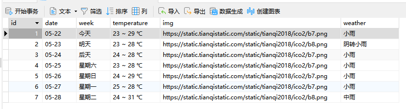

# 爬取广州最近一周天气

Python版本: 3.11.1

爬虫框架 :  [Scrapy](https://docs.scrapy.org/en/latest/)

目标 URL : https://www.tianqi.com/guangzhou/7/

## 运行

git clone 到本地后进入 `/weater` 运行 (建项目的时候单词打错了,就不改了)
```shell
scrapy crawl GZtianqi
```

## 添加多个城市

`weater/spiders/GZtianqi.py`

```python
class GztianqiSpider(scrapy.Spider):
    
    ...

    citys = ["guangzhou"] # 在列表中添加城市即可

    ...
```
## 三种数据持久化方式

- weather.txt
- weather.json
- mysql db


## Reference
- https://zhuanlan.zhihu.com/p/26885412